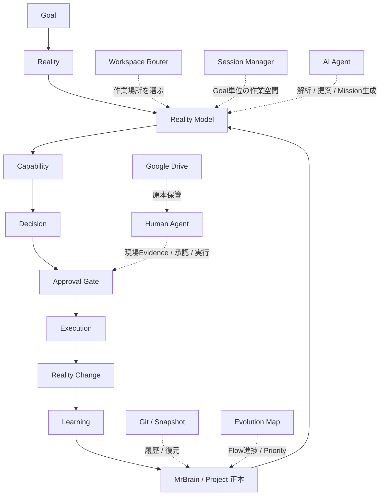

# AI Workspace OS Architecture Review

作成日: 2026-07-01

## 目的

このレビューは、新しいFuture CandidateやPrincipleを増やすためのものではない。

目的は、AI Workspace OS全体を俯瞰し、現在のFuture Candidateが本当に必要か、重複していないか、責務が明確か、Layer Leakがないかを確認することである。

最優先は、増やすことではなく、減らせるもの、統合できるもの、Projectへ降ろせるものを見つけること。

## 結論

現時点のAI Workspace OSは、Future Candidateを増やすフェーズから、実案件でEvidenceを集めてOSを育てるフェーズへ移行できる状態に近い。

ただし、まだCoreへ昇格すべきものは少ない。特に`Reality Model`、`Capability Registry`、`Decision Engine`、`Execution OS`は有望だが、HOTEL JOY以外の分野での検証が不足している。

今すぐやるべきことは、新しい概念追加ではなく、HOTEL JOYの1案件を使って次の流れを実運用で検証することである。

```md
Reality
↓
Reality Model
↓
Capability
↓
Decision
↓
Execution
↓
Learning
```

## Future Candidate一覧

| 名前 | 役割 | 現在のEvidence | 検証済みProject | Confidence | 昇格条件 | Merge候補 | 不要候補 |
|---|---|---|---|---|---|---|---|
| Capability Router | 必要能力からWorkspaceや成果物を組み立てる候補 | 実績不足 | なし | 低 | AI Workspace OSを3〜5回運用して必要性確認 | Capability Registryへ吸収候補 | 単独では不要候補 |
| Universal Event Model | 対象をInput / Event / Rule / State / Outputで分解する候補 | Hotel、AI Workspaceが仮成立 | Hotel、AI Workspace | 40% | 5分野以上で成立 | Reality Modelの表現形式へ吸収候補 | 単独Core化は保留 |
| Processing Engine Hypothesis | Ruleを状態変換エンジンとして扱う仮説 | Investmentのみ条件付き | Investment | 25% | 3〜5分野でRuleより自然なら改訂候補 | Decision EngineまたはUniversal Event Modelへ吸収候補 | 独立候補としては弱い |
| Goal-to-System Blueprint | GoalからCapability、Agent、Workspace、Artifact、Execution、Approval、Learningまで一気通貫で分解する候補 | メルカリ例のみ仮説 | メルカリ例 | 30% | 3〜5分野で抜け漏れ低下 | Architecture Templateとして残す | Engine化は不要 |
| Session Manager | Goal単位で一時作業Sessionを生成、管理、終了する候補 | 実運用前 | なし | 低〜中 | 複数Session運用で迷いが減る | Workspace Routerと連携 | CoreではなくOperation候補 |
| Capability Registry | 実装方法ではなく「できること」を管理する候補 | HOTEL JOY分析で有効 | HOTEL JOY | 中 | 3〜5分野でCapability / Implementation分離が自然 | Capability Routerを吸収候補 | 不要ではない |
| Reality Model | Capabilityより上流に現実構造を置く候補 | HOTEL JOY、投資、人体、AI Workspace例 | 例示段階 | 中 | 3〜5分野でReality / Capability / Executionが自然 | Universal Event Modelを表現形式として吸収候補 | 不要ではない |
| Execution OS | Capabilityを現実に実行するレイヤー候補 | HOTEL JOY、メルカリ例 | 例示段階 | 中 | 外部影響案件でApproval付き実行が再利用される | Approval Flowを含むOperation候補 | Core化は保留 |
| Decision Engine | Reality理解後、Execution前に何を実行すべきか決める候補 | HOTEL JOY、Booking、メルカリ等の例 | 例示段階 | 中 | 3〜5分野でDecisionがExecutionから独立 | Processing Engineを吸収候補 | 不要ではない |

## Core Layerレビュー

現在のCore候補は次の順番が最も自然。

```md
Reality
↓
Reality Model
↓
Capability
↓
Decision
↓
Execution
↓
Learning
```

### 順番

順番は概ね自然。

理由:
- Realityを理解しないとCapabilityを正しく選べない。
- Capabilityを選べても、次に何をするかをDecisionで決めないとExecutionが散らばる。
- Execution後にLearningしないと、OSが改善されない。

### 不足している層

現時点で新しい層は追加しない。

ただし、実運用では`Approval`がExecution前後に強く必要になる可能性が高い。これはCoreではなく、Execution OS内の安全ガードとして扱うのがよい。

### 不要またはMerge候補

`Universal Event Model`はCore Layerそのものではなく、Reality Modelを表現するためのモデル候補として扱う方が自然。

`Processing Engine Hypothesis`は独立Layerではなく、Universal Event Model内の`Rule`改訂案、またはDecision Engineの一部として扱う方がよい。

`Capability Router`は独立Candidateとして残すより、Capability RegistryまたはWorkspace Routerの内部機能として吸収する方が軽い。

## Operation Layerレビュー

Operation Layer候補:

| 項目 | 役割 | 判定 |
|---|---|---|
| Workspace Router | どこで作業するかを選ぶ | Operationとして適切 |
| Session Manager | Goal単位の一時作業空間を管理する | Operation候補。実運用後に判断 |
| Approval Flow | 外部影響前の承認を管理する | Execution OS内の必須ガード |
| Mission | Human Agentへ渡す実行単位 | Project / Operationの間。Project起点でよい |
| Git | 履歴管理と復元 | Operationとして適切 |
| Snapshot | 意味のある復元地点 | Operationとして適切 |
| Evolution Map | ProjectのFlow進捗とPriority管理 | Operationとして適切 |
| Workspace | ChatGPT、Codex、Cursor等の作業場所 | Operationとして適切 |

Coreへ入るべきもの:
- 現時点ではなし。

Projectへ移すべきもの:
- Missionの具体文面
- HOTEL JOY固有のEvidence
- メルカリ固有のExecution例

Operationとして適切なもの:
- Workspace Router
- Git / Snapshot
- Evolution Map
- Approval Flow

## Project Layerレビュー

対象Project:
- HOTEL JOY
- 投資
- 人体
- 経理
- AI Workspace
- Booking
- メルカリ

### Evidenceが足りないCandidate

| Candidate | 足りないEvidence |
|---|---|
| Reality Model | HOTEL JOY以外で実案件検証が必要 |
| Capability Registry | 経理、Booking、投資でCapability / Implementation分離の検証が必要 |
| Decision Engine | HOTEL JOY以外でDecisionとExecutionが分かれるか検証が必要 |
| Execution OS | 実際のApproval付き実行フローの検証が必要 |
| Session Manager | 複数Goal / 複数Chatで迷いが減るか検証が必要 |
| Universal Event Model | 投資、人体、経理、メール対応で成立確認が必要 |

### Reality Model検証状況

HOTEL JOYではかなり自然。

```md
Signal
↓
Event
↓
Rule
↓
State
↓
Output
```

投資、人体、AI Workspaceでは例示段階。実案件での検証はまだ不足。

### Decision Engine検証状況

HOTEL JOYでは自然。

例:

```md
退室
↓
清掃待ち
↓
清掃Mission生成
↓
Human Agent実行
```

Booking、メルカリ、投資、人体では例示段階。まだEvidence不足。

### Representative Evidence Set検証状況

HOTEL JOYでは有効性が高い。

例:
- PC裏全体写真
- 入力機器写真
- キーボード全体写真
- 型番写真
- 料金表
- 操作前後画面

ただし、他分野ではまだ検証不足。Core化せず、Reality Model内の観察候補として扱う。

## Layer Leakレビュー

| Candidate | 適切なLayer | 理由 |
|---|---|---|
| Capability Router | Operation / Capability Registry内部 | Workspace前段の振り分け機能でありCoreではない |
| Universal Event Model | Library / Reality Model内部 | Realityを表現する形式候補 |
| Processing Engine Hypothesis | Universal Event Model改訂候補 / Decision Engine内部 | 独立Coreには弱い |
| Goal-to-System Blueprint | Project Blueprint Template / Operation | 設計手順でありCore Principleではない |
| Session Manager | Operation | ChatやWorkspace運用の管理候補 |
| Capability Registry | Core Candidate寄り | Realityへ影響を与える能力管理として再利用性が高い |
| Reality Model | Core Candidate寄り | Capabilityより上流の対象理解として再利用性が高い |
| Execution OS | Operation / Core Candidateの境界 | 外部影響を扱うため重要だが実装方法寄り |
| Decision Engine | Core Candidate寄り | RealityとExecutionの間の判断責務として再利用性が高い |

## Responsibilityレビュー

| 概念 | 一言の責務 |
|---|---|
| Reality | 現実を表す |
| Reality Model | Realityを理解可能な構造へ変換する |
| Universal Event Model | Reality Modelの表現形式候補 |
| Representative Evidence Set | Reality全体を推定するための代表Evidence集合 |
| Capability | Realityへ影響を与える能力 |
| Capability Registry | Capabilityと実装候補を管理する |
| Decision | 次に何を実行するか決める |
| Decision Engine | RealityとGoalから次の実行内容を選ぶ |
| Execution | 現実を変える |
| Execution OS | Capabilityを現実で実行する方法と承認を管理する |
| Session Manager | Goal単位の一時作業空間を管理する |
| Workspace Router | 最小エネルギーで作業場所を選ぶ |
| Learning | 実行結果をMrBrainへ戻し、次回を改善する |

## Merge候補

### 1. Capability Router → Capability Registryへ吸収

Capability Routerは、必要能力からWorkspaceや成果物を組み立てる候補だが、現時点ではCapability Registryの選択機能として扱えば十分。

独立候補として育てるより、Capability Registry内の運用機能に降格する方が軽い。

### 2. Processing Engine Hypothesis → Universal Event Model改訂候補、またはDecision Engineへ吸収

Processing Engineは、`Rule`が静的ではなく状態変換であるという発見。

これは独立Engineにせず、まずはUniversal Event Modelの`Rule`改訂候補として扱う。

もし「状態から次の判断を生む処理」としての性質が強い場合は、Decision Engineへ吸収できる。

### 3. Universal Event Model → Reality Modelの表現形式候補へ降格

Universal Event Modelは有用だが、Reality Modelより上位ではない。

Reality Modelの中で、対象を説明するための形式候補として扱う方が自然。

### 4. Goal-to-System Blueprint → Architecture Templateとして残す

Goal-to-System BlueprintはOSのCoreではなく、案件を設計するテンプレートとして有用。

Future Candidateとして昇格を急がず、Project Blueprint Templateとして実運用で使う方がよい。

## Missing Layer

現時点で、新しいLayerは追加しない。

理由:
- Reality / Capability / Decision / Execution / Learningで、現時点の主要な流れは説明できる。
- ApprovalはExecution OS内の安全ガードとして扱える。
- Workspace / Session / Git / SnapshotはOperation Layerで説明できる。
- Artifact / Deliveryは重要だが、まだ独立LayerとしてCore化するEvidenceが不足している。

強いて言えば、`Approval`は外部影響の安全性に直結するため重要だが、Core LayerではなくExecution OSの必須処理として扱うのが現時点では最も軽い。

## Architecture図



## Evolution Review

AI Workspace OSは、Future Candidateを増やすフェーズから、OSを育てるフェーズへ移行できる。

移行条件は、次の3つ。

1. 新しいCandidate追加を止める
2. HOTEL JOYでReality → Decision → Executionまで1回通す
3. その結果をEvidenceとしてFuture Candidate表へ戻す

現時点では、概念の輪郭は十分に出ている。

次に必要なのは、追加設計ではなく、実案件で「どの層が本当に効いたか」を測ること。

## Next Best Action

最も価値が高い次の一手:

**HOTEL JOY Signal / 料金システム調査を、Reality → Capability → Decision → Execution → Learningの1本の実案件として記録する。**

理由:
- HOTEL JOYはRealityが最も具体的。
- Signal、料金、部屋State、売上、Human Agent、Approval、Executionがすべて含まれる。
- 1案件でReality Model、Capability Registry、Decision Engine、Execution OSを同時に検証できる。

## 自己レビュー

Layer Leak:
なし。この文書はAI Workspace OS Project内のArchitecture Reviewであり、Kernel / Principle / AI_CONTEXT / AGENTSには触れていない。

責務重複:
あり。`Capability Router`は`Capability Registry`へ吸収候補。`Processing Engine Hypothesis`は`Universal Event Model`または`Decision Engine`へ吸収候補。

Kernel混入:
なし。毎回読む最小Kernelではなく、Project内の設計レビューとして保存する。

Operation肥大化:
注意が必要。Workspace Router、Session Manager、Approval Flow、Git、Snapshot、Evolution Mapが増えている。現時点ではOperation Layerとして整理できるが、実運用で不要なものは統合する。

Project依存:
HOTEL JOY依存が強い。投資、人体、経理、Booking、メルカリで検証しない限りCore昇格しない。

概念増加:
かなり増えている。今後は追加より、統合とEvidence更新を優先する。

Merge候補:
- Capability Router → Capability Registry
- Processing Engine Hypothesis → Universal Event Model改訂候補、またはDecision Engine
- Universal Event Model → Reality Modelの表現形式候補
- Goal-to-System Blueprint → Project Blueprint Template

削除候補:
現時点で削除はしない。ただし、Capability RouterとProcessing Engine Hypothesisは、独立候補としての価値が低ければ将来Archive候補。

改善案:
Future Candidateごとに「次に検証するProject」を1つだけ決める。複数候補を同時に育てず、HOTEL JOYから順にEvidenceを戻す。
