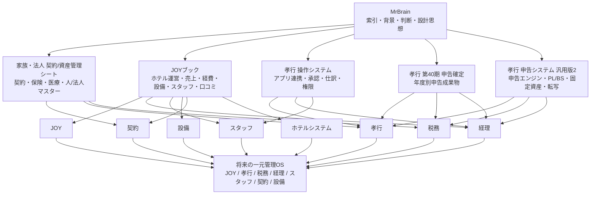
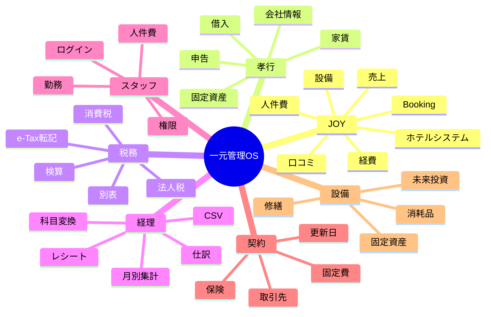

# 5スプレッドシート現状分析

## 目的
5つのGoogleスプレッドシートが何を管理しているか、どこが重複しているか、何が不足しているか、MrBrain・JOY・孝行・税務・経理・スタッフ・契約・設備とどう関係しているかを整理する。

この文書は改善案ではなく、現状分析である。

## 対象スプレッドシート
| No | スプレッドシート名 | 現在の中心目的 | 主な管理領域 |
|---|---|---|---|
| 1 | 家族・法人_契約状況及び資産記録一元管理シート | 家族・法人の契約、固定費、保険、医療費、人・法人マスターの集約 | 契約、保険、医療、固定費、家族、法人マスター |
| 2 | JOY | ホテルJOYの運営台帳 | JOY、経理、設備、スタッフ、売上、経費、固定費、取引先、口コミ、Booking |
| 3 | 孝行_操作システム_アプリ連携版 | アプリから受けた入力を承認し、仕訳帳へ渡す操作レイヤー | 孝行、アプリ連携、スタッフ、権限、仕訳、科目変換 |
| 4 | 孝行_第40期申告システム_確定 | 孝行 第40期の申告完成版 | 税務、申告、PL、BS、消費税、e-Tax転記、売上、経費 |
| 5 | 孝行_申告システム_汎用版2 | 申告システムを汎用化したエンジン版 | 税務、経理、申告、アプリ連携、仕訳帳、固定資産 |

## 1. 各スプレッドシートの目的

### 1. 家族・法人_契約状況及び資産記録一元管理シート
家族と法人にまたがる契約・固定費・保険・医療費を集約するシート。

確認できた主なタブ:
- 総合ダッシュボード
- 固定費・インフラ契約
- 保険・共済契約
- 国保・医療費記録
- 00_Master_Plan
- 01_Human_Master
- 02_Entity_Master

現状の特徴:
- 契約、保険、医療費、固定費を一つに集めている。
- 人と法人をIDで管理しようとしている。
- 「マスターで一元化し、他シートから参照する」という設計思想がある。
- 個人・家族・法人が同じブックに入っている。

MrBrain上の関係:
- `02_LIFE`
- `03_BUSINESS/契約`
- `03_BUSINESS/税務`
- `03_BUSINESS/孝行`
- `01_ME`

### 2. JOY
ホテルJOYの実運営を幅広く管理する巨大な台帳。

確認できた主なタブ:
- 設備・消耗品
- 会社情報
- 会社お金の流れ
- 取引先情報
- 固定費
- 売上
- 人件費
- 経費入力
- 減価償却費
- 税金
- 家記録
- Booking掲載
- 集計
- 口コミ返信
- 未来投資
- 孝行事務所
- 各種ショートカット

現状の特徴:
- JOYの運営情報がかなり広く入っている。
- 売上、経費、人件費、固定費、税金、設備、取引先が同居している。
- Booking掲載文や口コミ返信文など、ホテル運営の文章資産も入っている。
- ショートカット集や未来投資、孝行事務所など、JOY以外の情報も混在している。
- `シート13` は現時点で中身が確認できず、役割不明。

MrBrain上の関係:
- `03_BUSINESS/JOY`
- `03_BUSINESS/経理`
- `03_BUSINESS/スタッフ`
- `03_BUSINESS/取引先`
- `03_BUSINESS/設備`
- `04_PROJECTS/ホテルシステム`

### 3. 孝行_操作システム_アプリ連携版
孝行の経理入力をアプリ化するための操作レイヤー。

確認できた主なタブ:
- 0.1_開発ステータス
- 01_マスタ
- 01.1_科目変換マスタ
- 01.2_スタッフマスタ
- 01.3_権限マスタ
- 11_アプリ連携受取
- 02_仕訳帳
- 00_ダッシュボード
- 0.2_アプリ画面設計

現状の特徴:
- アプリから送られたデータを受ける場所がある。
- 承認ステータス、科目変換、仕訳帳への反映という流れがある。
- スタッフマスタと権限マスタがあり、スタッフ入力を前提にしている。
- アプリ画面設計があり、実アプリ化をかなり意識している。
- 税務計算や固定資産管理は申告システム側へ分離する方針が書かれている。

MrBrain上の関係:
- `04_PROJECTS/経理アプリ`
- `04_PROJECTS/申告システム`
- `03_BUSINESS/孝行`
- `03_BUSINESS/スタッフ`
- `03_BUSINESS/経理`

### 4. 孝行_第40期申告システム_確定
孝行の第40期申告を完成させるための年度別・確定版ブック。

確認できた主なタブ:
- 00_引き継ぎ
- 00b_明細→経費変換
- 17_ダッシュボード
- 19_申告アクションプラン
- 02_会社マスタ
- 03_期首BS
- 04_売上入力
- 05_経費入力
- 06_減価償却
- 07_PL
- 08_BS
- 09_消費税
- 別表系
- 14_eTax転記ガイド
- 16_勘定科目

現状の特徴:
- 特定年度の申告完成版。
- 売上、経費、減価償却、PL、BS、消費税、別表、e-Tax転記まで含む。
- 申告に必要な数字と判断メモが強く結びついている。
- 汎用システムというより、年度別の成果物・証跡に近い。

MrBrain上の関係:
- `03_BUSINESS/孝行`
- `03_BUSINESS/税務`
- `03_BUSINESS/経理`
- `04_PROJECTS/申告システム`

### 5. 孝行_申告システム_汎用版2
第40期申告システムを汎用化し、別会社にも使えるようにした申告エンジン版。

確認できた主なタブ:
- 00_はじめに
- 01_マスタ
- 0.1_開発ステータス
- 01.1_科目変換マスタ
- 11_アプリ連携受取
- 04_PL
- 05_BS
- 06_固定資産
- 07_所得税額
- 08_転写ガイド
- 09_検算
- 10_翌期引継
- 01.2_スタッフマスタ
- 02_仕訳帳

現状の特徴:
- 「収入と支出を入れるだけで申告に必要な表を作る」思想がある。
- 仕訳帳、PL、BS、固定資産、転写ガイド、検算、翌期引継まで持っている。
- アプリ連携受取と科目変換マスタがあり、操作システムと似た入口を持つ。
- スタッフマスタもあり、経理入力を人・権限とつなげる構想がある。
- 確定版より抽象化されているが、孝行の情報も残っている。

MrBrain上の関係:
- `04_PROJECTS/申告システム`
- `04_PROJECTS/経理アプリ`
- `03_BUSINESS/孝行`
- `03_BUSINESS/税務`
- `03_BUSINESS/経理`

## 2. 重複している管理

## A. 会社情報の重複
同じ会社情報が複数の場所にある。

該当:
- 家族・法人シートの `02_Entity_Master`
- JOYの `会社情報`
- 孝行_操作システムの `01_マスタ`
- 孝行_第40期申告システムの `02_会社マスタ`
- 孝行_申告システム_汎用版2の `01_マスタ`

重複内容:
- 法人名
- 代表者
- 法人番号
- 所在地
- 連絡先
- 会計期間
- 事業内容

現状の意味:
会社情報が「参照元」と「申告用」と「アプリ用」に分散している。

## B. 経理入力の重複
経費・収入・仕訳に関する入口が複数ある。

該当:
- JOY `経費入力`
- JOY `売上`
- JOY `人件費`
- 孝行_操作システム `11_アプリ連携受取`
- 孝行_操作システム `02_仕訳帳`
- 孝行_第40期申告システム `04_売上入力`
- 孝行_第40期申告システム `05_経費入力`
- 孝行_申告システム_汎用版2 `11_アプリ連携受取`
- 孝行_申告システム_汎用版2 `02_仕訳帳`

重複内容:
- 日付
- 内容
- 金額
- 勘定科目
- 支払方法
- 摘要
- レシート・証憑URL

現状の意味:
「入力する場所」と「申告へ渡す場所」がまだ完全には一本化されていない。

## C. 科目変換・勘定科目の重複
科目変換や勘定科目のルールが複数ブックにある。

該当:
- 孝行_操作システム `01.1_科目変換マスタ`
- 孝行_第40期申告システム `16_勘定科目`
- 孝行_申告システム_汎用版2 `01.1_科目変換マスタ`
- JOY `経費入力` の分類列

現状の意味:
同じ支出でも、ブックごとに分類ルールが変わる可能性がある。

## D. 固定費・契約の重複
契約・固定費が複数箇所にある。

該当:
- 家族・法人シート `固定費・インフラ契約`
- 家族・法人シート `保険・共済契約`
- JOY `固定費`
- JOY `会社情報`
- JOY `取引先情報`
- JOY `税金`

現状の意味:
生活契約、法人契約、ホテル運営契約、税金支払いが混ざりながら複数管理されている。

## E. 設備・資産の重複
設備・消耗品・固定資産が近い意味で複数箇所にある。

該当:
- JOY `設備・消耗品`
- JOY `未来投資`
- JOY `減価償却費`
- JOY `家記録`
- 孝行_申告システム_汎用版2 `06_固定資産`
- 孝行_第40期申告システム `06_減価償却`

現状の意味:
現場で使う設備メモ、将来買いたい物、税務上の固定資産、家や土地の記録が同じ「資産・設備」領域にあるが、目的が分かれている。

## F. スタッフ管理の重複
スタッフや権限に関する管理が複数ある。

該当:
- JOY `人件費`
- 孝行_操作システム `01.2_スタッフマスタ`
- 孝行_操作システム `01.3_権限マスタ`
- 孝行_申告システム_汎用版2 `01.2_スタッフマスタ`

現状の意味:
JOYは勤務・人件費、孝行系はアプリログイン・権限としてスタッフを見ている。

## G. アプリ連携の重複
アプリ連携用の受け皿が複数ある。

該当:
- 孝行_操作システム `11_アプリ連携受取`
- 孝行_申告システム_汎用版2 `11_アプリ連携受取`
- 孝行_操作システム `0.2_アプリ画面設計`
- 孝行_申告システム_汎用版2 `0.1_開発ステータス`

現状の意味:
「操作アプリ」と「申告エンジン」の境界がまだ完全には分かれていない。

## 3. 不要または役割不明に見えるシート

これは削除提案ではなく、現状として役割が弱い・不明なものの記録。

| ブック | シート | 現状 |
|---|---|---|
| JOY | シート13 | 読み取った範囲では中身なし。役割不明。 |
| JOY | 各種ショートカット | JOY運営台帳というより個人作業メモに近い。 |
| JOY | 未来投資 | 設備候補・買いたい物リスト。運営台帳と混在。 |
| JOY | 孝行事務所 | JOYではなく孝行または設備系のメモに見える。 |
| 孝行_操作システム | 0.2_アプリ画面設計 | 重要だが、経理データではなく開発仕様。 |
| 孝行_申告システム_汎用版2 | 0.1_開発ステータス | 重要だが、申告データではなく開発仕様。 |

## 4. 統合できそうに見える管理領域

これは改善実行案ではなく、現状から見える「同じ種類の情報」の整理。

| 管理領域 | 現在散らばっている場所 | 現状の見え方 |
|---|---|---|
| 会社マスター | 家族・法人、孝行操作、孝行確定、汎用版、JOY | 会社情報が複数に分散 |
| 人・スタッフ | 家族・法人Human、JOY人件費、孝行スタッフマスタ | 家族、人件費、ログイン権限が別々 |
| 経費入力 | JOY経費、孝行確定、孝行操作、汎用版 | 入力口が複数 |
| 売上入力 | JOY売上、孝行確定、汎用版仕訳帳 | 事業ごとに形式が違う |
| 契約・固定費 | 家族・法人、JOY固定費、JOY会社情報、JOY取引先 | 契約と取引先が混在 |
| 設備・資産 | JOY設備、JOY未来投資、JOY減価償却、孝行固定資産 | 現場管理と税務資産が混在 |
| 税務申告 | 孝行確定、汎用版、JOY税金 | 申告成果物と日常支払いが混在 |
| アプリ連携 | 孝行操作、汎用版 | 操作レイヤーと申告エンジンに同種機能がある |

## 5. 不足している管理

現状のシート群から見える不足。改善案ではなく、まだ明確な置き場が弱いもの。

### A. 全体の親インデックス
5ブック全体を横断する「どの情報がどこにあるか」の正式な索引が弱い。

該当する不足:
- どのブックが正本か
- どのシートが古いか
- どのシートが入力用か
- どのシートが集計用か
- どのシートが開発仕様か

### B. データの正本ルール
同じ情報が複数箇所にあるため、「どれが正しいか」の判断が難しい。

該当する不足:
- 会社情報の正本
- スタッフ情報の正本
- 勘定科目の正本
- 契約情報の正本
- 設備・固定資産の正本

### C. JOYと孝行の境界
JOYブック内に孝行事務所、税金、家記録、孝行関連のお金の流れが入っている。

現状の不足:
- JOYの運営情報
- 孝行の法人情報
- 家族・個人情報

この3つの境界がまだ曖昧。

### D. 契約と支払いの接続
契約情報と実際の支払い・経費入力が別々にある。

現状の不足:
- 契約から支払い予定へつながる線
- 支払いから経費・税務へつながる線
- 更新日や解約日からタスクへつながる線

### E. ホテルシステムとの接続
JOYブックにはホテル運営情報が多いが、Laravelのホテルシステムとの接続情報はまだ明確ではない。

現状の不足:
- ホテルシステムが管理するもの
- スプレッドシートが管理するもの
- MrBrainが記録するもの
- 将来OSが管理するもの

## 6. MrBrainとの関係

MrBrainは、5つのスプレッドシートの中身を全部置く場所ではなく、索引・背景・判断・設計思想を置く場所。

| MrBrain | 関係するスプレッドシート | 役割 |
|---|---|---|
| `00_HOME` | 全体 | 今見るべき優先順位 |
| `03_BUSINESS/JOY` | JOY | ホテルJOY運営の入口 |
| `03_BUSINESS/孝行` | 孝行3ブック | 孝行の会社管理入口 |
| `03_BUSINESS/経理` | JOY、孝行操作、孝行確定、汎用版 | 経費・売上・仕訳の整理 |
| `03_BUSINESS/税務` | 孝行確定、汎用版、JOY税金 | 申告・消費税・法人税の整理 |
| `03_BUSINESS/スタッフ` | JOY人件費、孝行スタッフマスタ | 人と権限・勤務の整理 |
| `03_BUSINESS/契約` | 家族・法人、JOY固定費、JOY取引先 | 契約・固定費の索引 |
| `03_BUSINESS/設備` | JOY設備、未来投資、固定資産 | 設備・資産の整理 |
| `04_PROJECTS/経理アプリ` | 孝行操作、汎用版 | アプリ入力・承認・連携 |
| `04_PROJECTS/ホテルシステム` | JOY | ホテル運営システムとの接続 |
| `04_PROJECTS/スプレッドシート整理` | 全体 | 5ブックの現状分析と統合構想 |

## 7. 頭の中の図解

## 8. 現状の構造を一言で言うと

現在は、5つのスプレッドシートがそれぞれ別々に進化している。

- 家族・法人シートは「契約・資産・人/法人マスター」
- JOYは「ホテル運営の全部入り台帳」
- 孝行_操作システムは「アプリ入力と承認の入口」
- 孝行_第40期申告システムは「申告済み年度の成果物」
- 孝行_申告システム_汎用版2は「申告エンジン化の試作品」

その結果、経理アプリだけではなく、実際には次の7領域をつなぐOS構想になっている。

## 9. 現状分析の結論

現状は「経理アプリを作りたい」段階ではなく、すでに次の情報が分散して存在している。

- JOYの運営台帳
- 孝行の申告システム
- 汎用申告エンジン
- アプリ連携の入力口
- スタッフと権限の構想
- 家族・法人の契約台帳
- 設備・固定資産・未来投資のメモ
- ホテル運営の文章資産

頭の中では、経理だけではなく、会社とホテル運営全体をつなぐOSを作ろうとしている。

今あるスプレッドシートは、そのOSの部品がバラバラに作られている状態。
